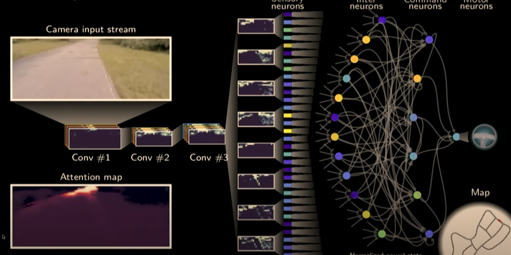
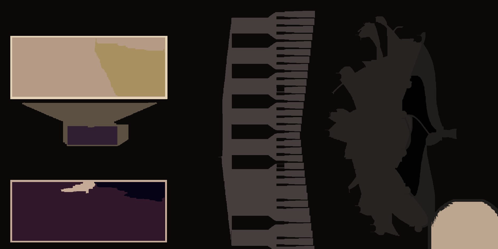

# Python Implementation

---

To use run the algorithm on a test image:

```bash
python srm.py /path_to_you_image 32 15 0.001
```

And the program will output, within the same directory, a file `Segmented_your_image.png`

---

# Algorithm in Action

### Reference Image


### Segmented Image


---